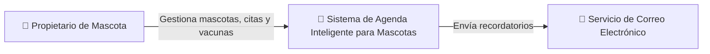
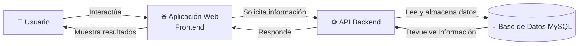

# Modelo C4

## Introducción

El Modelo C4 permite representar la arquitectura del sistema mediante diferentes niveles de abstracción, facilitando la comprensión de los componentes y sus interacciones.

## Nivel 1: Contexto

Este nivel muestra la interacción entre el usuario y el Sistema de Agenda Inteligente para Mascotas, así como los sistemas externos utilizados para el envío de recordatorios.

## Nivel 2: Contenedores

Este nivel presenta los componentes principales del sistema: Aplicación Web, API Backend y Base de Datos.

## Conclusión

Los diagramas C4 permiten comprender de forma clara la estructura general del sistema y la distribución de responsabilidades entre sus diferentes componentes, facilitando futuras etapas de desarrollo y mantenimiento.